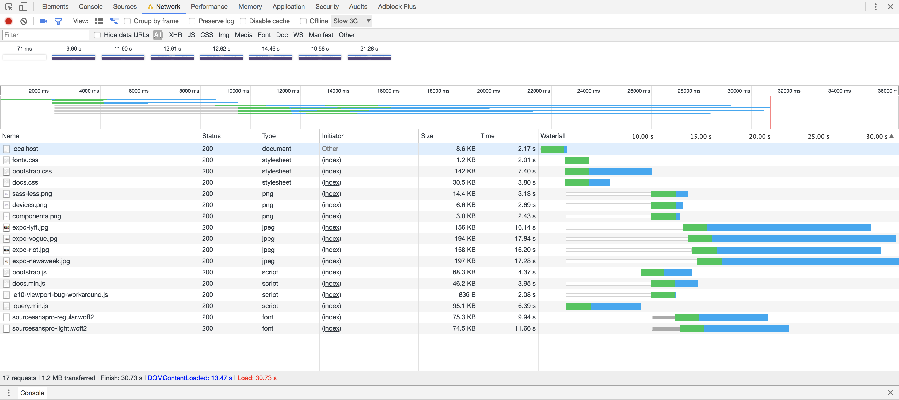
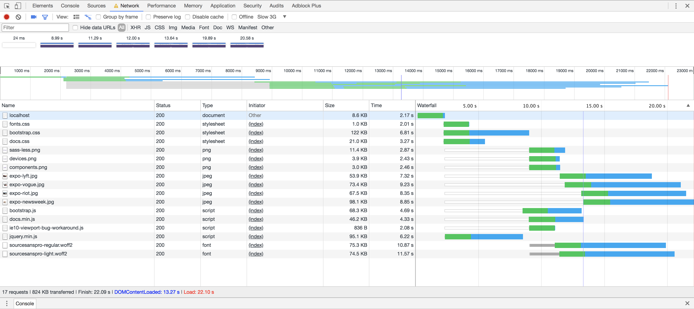
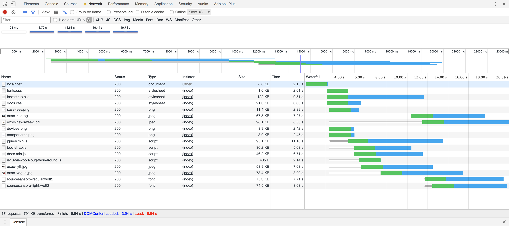
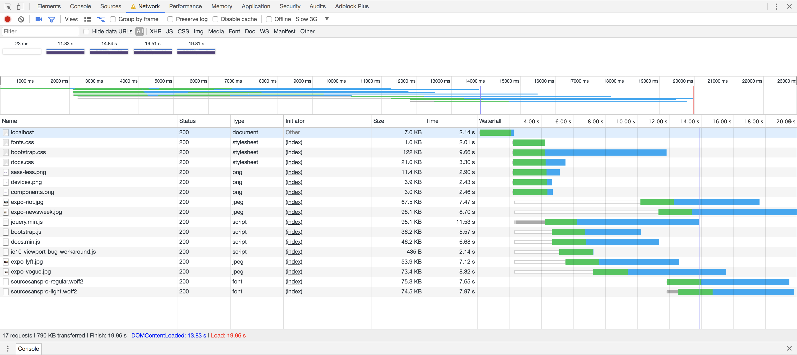
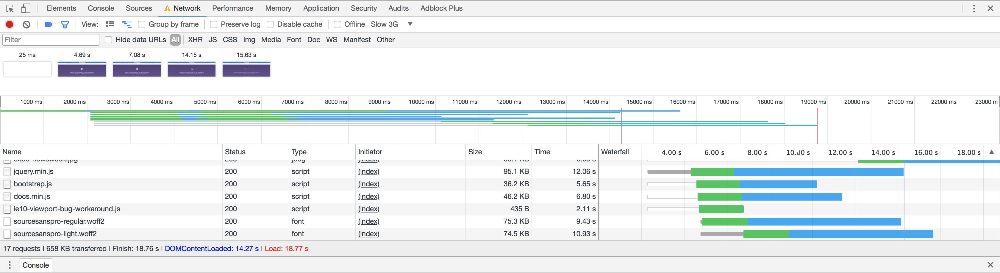
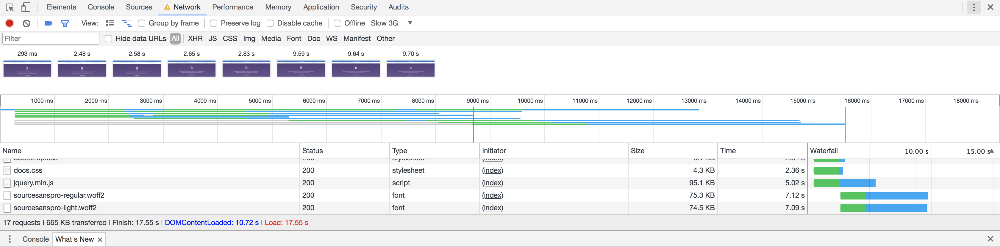

# Performance matters

## Project setup

This project serves an adapted version of the [Bootstrap documentation website](http://getbootstrap.com/). It is based on the [github pages branche of Bootstrap](https://github.com/twbs/bootstrap/tree/gh-pages). 

Differences from actual Bootstrap documentation:

- Added custom webfont
- Removed third party scripts
- The src directory is served with [Express](https://expressjs.com/).
- Templating is done with [Nunjucks](https://mozilla.github.io/nunjucks/)

## Project progress

#### Run 1: Init

#### Run 2: Minify CSS

#### Run 3: Optimize Images

#### Run 4: Minify JavaScript

#### Run 5: Minify HTML

#### Run 6: Unused CSS & Font Display: swap

#### Run 7: Critical CSS & Async CSS

## Getting started

- Install dependencies: `npm install`
- Serve: `npm start`
- Expose localhost: `npm run expose`