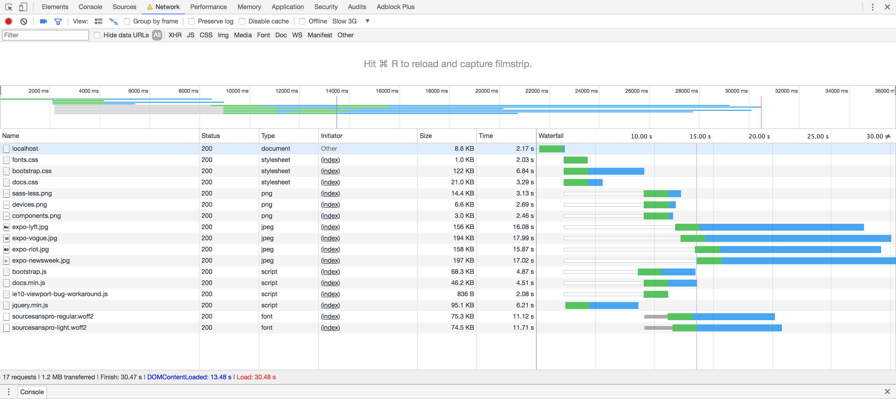

# Performance matters

## Project setup

This project serves an adapted version of the [Bootstrap documentation website](http://getbootstrap.com/). It is based on the [github pages branche of Bootstrap](https://github.com/twbs/bootstrap/tree/gh-pages). 

Differences from actual Bootstrap documentation:

- Added custom webfont
- Removed third party scripts
- The src directory is served with [Express](https://expressjs.com/).
- Templating is done with [Nunjucks](https://mozilla.github.io/nunjucks/)

## Project progress

#### Run 1: Init

- *First meaningful paint:* 09.60s
- *Total load time:* 30.73s

#### Run 2: Minify CSS

- *First meaningful paint:* -
- *Total load time:* 30.48s

#### Run 3: Optimize Images

- *First meaningful paint:* 08.99s
- *Total load time:* 22.10s

#### Run 4: Minify JavaScript

- *First meaningful paint:* 11.70s
- *Total load time:* 19.94s

#### Run 5: Minify HTML

- *First meaningful paint:* 11.80s
- *Total load time:* 19.96s

#### Run 6: Unused CSS & Font Display: swap

- *First meaningful paint:* 04.69s
- *Total load time:* 18.77s

#### Run 7: Critical CSS & Async CSS

- *First meaningful paint:* *293ms!*
- *Total load time:* 17.55s

## Getting started

- Install dependencies: `npm install`
- Serve: `npm start`
- Expose localhost: `npm run expose`